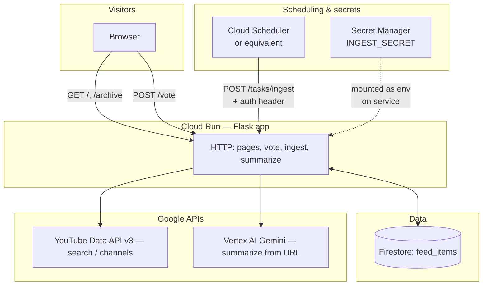
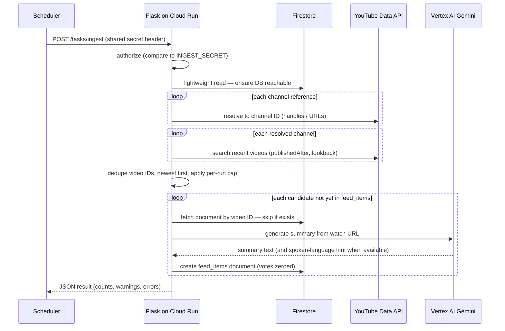

# YT Naslovnica

An **aggregated front page** built from **hand-picked YouTube channels** oriented toward **Croatia and Zagreb**: national and regional news, broadcasters, tourism, expat-oriented creators, and related topics. Scheduled jobs pull **recent uploads**, generate a **short English headline and summary** per video via **Vertex AI (Gemini)**, and persist everything for the web UI. Visitors **vote** on items; the **main feed lists recent posts** (configurable window) **sorted primarily by upvotes**, then **newest first**, so strong items stay visible. Older posts move to **`/archive`**.

In-product branding: **Youtube Naslovnica** (compact **YT Naslovnica** on narrow screens).

**Where it runs:** packaged as a **Docker** image and served on **Google Cloud Run** (`hackathon`, project **`summarizer-lab`**, region **`europe-west1`**).

---

## Architecture

The system is a **single Flask application** behind Cloud Run. It renders HTML, talks to **Firestore** for persisted feed rows, calls **YouTube Data API v3** to discover videos and resolve channels, and calls **Vertex AI** so Gemini summarizes each new video from its watch URL.

**Ingress (browser):**

- **`GET /`** — active feed (published within `FEED_DAYS`, default 30), ordered after load by **upvotes desc**, then **publish time desc**.
- **`GET /archive`** — items older than that window (larger query limit).
- **`POST /vote`** — increments `upvotes` or `downvotes` on a `feed_items` document and redirects back.
- **`GET|POST /summarize`** — optional path to summarize an arbitrary pasted YouTube URL (primarily utility / experimentation).

**Background ingestion:**

- **`POST /tasks/ingest`** — protected by **`INGEST_SECRET`** (header or bearer); runs one ingestion pass. In production this is invoked on a timer (e.g. **Cloud Scheduler**) so the corpus stays fresh without user action.

**On cold start**, optional env flags (**`INITIAL_INGEST_ON_STARTUP`**, **`FORCE_INGEST_ON_STARTUP`**) can trigger a single in-process ingest in the background (`app.py`); that path does not require the HTTP secret.

### Diagram

### Ingest sequence (one scheduled run)

### Ingest pipeline (conceptual)

1. **Sources:** channel list from configuration (env) or **`DEFAULT_CHANNEL_SOURCES`** in **`app.py`** — handles/`@handles`/URLs resolved to channel IDs via YouTube.
2. **Discovery:** **`search.list`** per channel inside a **lookback** window; cap **maximum new videos per run**.
3. **Deduplication:** document id = YouTube **`video_id`** — existing docs are skipped.
4. **Enrichment:** English card title normalization; **Gemini** summary (and spoken-language hint where available); write document with votes initialized to zero.

---

## Data model

Collection **`feed_items`**, document id = YouTube video id.

Stored fields include **`title`** (display headline), **`title_raw`**, **`url`**, **`channel`**, **`published_at`**, **`summary`**, **`primary_language`**, **`upvotes`**, **`downvotes`**.

---

## Components (stack)

| Layer | Role |
|-------|------|
| **Flask + Jinja templates** | Server-rendered UI and form posts |
| **Firestore** | Durable feed and vote counters |
| **YouTube Data API v3** | Channel resolution and recent video discovery |
| **Vertex AI / Gemini** | Per-video summaries from watch URLs |
| **Cloud Run** | Stateless container runtime; autoscaled HTTPS endpoint |
