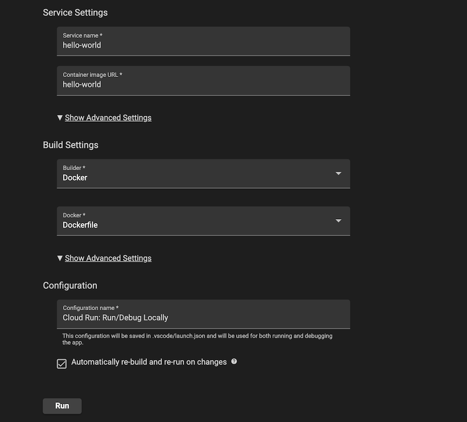
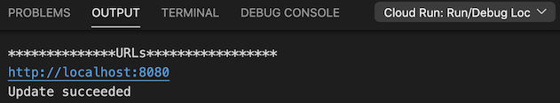
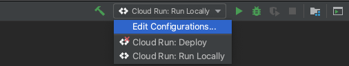
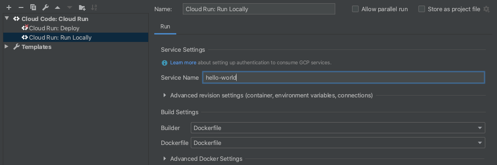
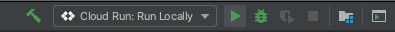
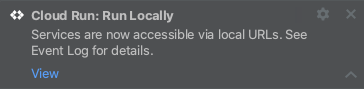

# Cloud Run Hello World with Cloud Code

"Hello World" is a [Cloud Run](https://cloud.google.com/run/docs) application that renders a simple webpage.

## YouTube Newsfeed

Server-rendered feed of summarized YouTube videos (Gemini on Vertex AI), Firestore storage, optional ingestion via YouTube Data API (`POST /tasks/ingest`).

**Canonical Cloud Run service:** deploy this repo to **`hackathon`** (`summarizer-lab`, `europe-west1`). Example URL shape: `https://hackathon-<PROJECT_NUMBER>.europe-west1.run.app`. The **`youtube-summarizer`** service name is legacy—ignore it unless you explicitly maintain it.

### Required before anything works: Firestore

The app reads/writes collection **`feed_items`** in **Cloud Firestore (Native mode)** in the **same GCP project** as Cloud Run (`GOOGLE_CLOUD_PROJECT` / `GCP_PROJECT`).

If you see **`404 The database (default) does not exist`**, the database was never created for that project:

1. Open **[Firestore / Datastore setup](https://console.cloud.google.com/firestore)** (pick project **`summarizer-lab`** or whichever project your service uses).
2. **Create database** → choose **Native mode** → region → finish provisioning.
3. Ensure Cloud Run’s **`GOOGLE_CLOUD_PROJECT`** matches that project (otherwise you enabled Firestore in the wrong place).

Until Firestore exists, the feed, archive, votes, and ingestion cannot persist data.

### Provision with gcloud (script)

From `youtube-summarizer-1`:

```bash
export GOOGLE_CLOUD_PROJECT=summarizer-lab   # or your real project id
chmod +x scripts/setup_gcp_infrastructure.sh
./scripts/setup_gcp_infrastructure.sh        # or: ./scripts/setup_gcp_infrastructure.sh YOUR_PROJECT_ID
```

Optional: `FIRESTORE_LOCATION=europe-west3 ./scripts/setup_gcp_infrastructure.sh` if you want another [Firestore region](https://cloud.google.com/firestore/docs/locations).

### Provision manually (same steps)

```bash
PROJECT_ID=summarizer-lab   # change me
REGION=europe-west1         # Firestore location; aligns with default Vertex region in app.py

gcloud services enable \
  --project="$PROJECT_ID" \
  firestore.googleapis.com \
  aiplatform.googleapis.com \
  youtube.googleapis.com \
  run.googleapis.com \
  artifactregistry.googleapis.com \
  cloudbuild.googleapis.com \
  iam.googleapis.com

gcloud firestore databases create --project="$PROJECT_ID" --location="$REGION"

PROJECT_NUMBER="$(gcloud projects describe "$PROJECT_ID" --format='value(projectNumber)')"
RUNTIME_SA="${PROJECT_NUMBER}-compute@developer.gserviceaccount.com"

gcloud projects add-iam-policy-binding "$PROJECT_ID" \
  --member="serviceAccount:${RUNTIME_SA}" \
  --role="roles/datastore.user" \
  --quiet

gcloud projects add-iam-policy-binding "$PROJECT_ID" \
  --member="serviceAccount:${RUNTIME_SA}" \
  --role="roles/aiplatform.user" \
  --quiet
```

Create a **YouTube Data API key** under APIs & Services → Credentials (Console). Set Cloud Run env vars (`YOUTUBE_API_KEY`, etc.) per below.

### Environment variables

| Variable | Required | Description |
|----------|----------|-------------|
| `GOOGLE_CLOUD_PROJECT` / `GCP_PROJECT` | Deploy | GCP project id (defaults to `summarizer-lab` if unset). |
| `VERTEX_LOCATION` | No | Vertex AI region (default `europe-west1`). |
| `GEMINI_MODEL` | No | Model id (default `gemini-2.5-flash`). |
| `YOUTUBE_API_KEY` | Ingestion | YouTube Data API v3 key. |
| `YOUTUBE_CHANNEL_IDS` | Ingestion override | Comma-separated channel **ids** (`UC…`) and/or **URLs** with `/@handle/` (or bare handles). **If unset**, built-in Croatia/expat placeholder channels are used (see `DEFAULT_CHANNEL_SOURCES` in `app.py`). |
| `INGEST_SECRET` | Recommended | If set, ingest requires header `X-Ingest-Secret`. |
| `INGEST_LOOKBACK_DAYS` | No | Search window (default `30`). |
| `MAX_VIDEOS_PER_RUN` | No | Max new summaries per run (default `25`). |
| `INITIAL_INGEST_ON_STARTUP` | No | If `true`, run one ingest in the background when the container starts **only if `feed_items` is empty** (first deploy). Requires `python app.py` as entrypoint (not all process managers). |
| `FORCE_INGEST_ON_STARTUP` | No | If `true`, run startup ingest even when the feed already has items (still skips videos already stored). Often used with `INITIAL_INGEST_ON_STARTUP=true`. |
| `PORT` | No | Listen port (default `8080`). |

### Firestore

Use Native mode. Collection `feed_items`, document id = YouTube video id. Fields: `title`, `url`, `channel`, `published_at`, `summary`, `upvotes`, `downvotes`. Feed shows items published in the last 7 days; older items appear under `/archive`.

### Local run

```bash
cd youtube-summarizer-1
pip install -r requirements.txt
export GOOGLE_CLOUD_PROJECT=your-project
gcloud auth application-default login
python app.py
```

### Manual ingest (force a run now)

From your laptop or Cloud Shell against the deployed or local URL:

```bash
curl -sS -X POST "${SERVICE_URL}/tasks/ingest" \
  -H "X-Ingest-Secret: $INGEST_SECRET"
```

Use `-v` to confirm HTTP status. Omit `X-Ingest-Secret` if `INGEST_SECRET` is unset (prototype only).

Target **`hackathon`** (your Cloud Run URL), e.g.:

```bash
curl -sS -X POST "https://hackathon-818144832337.europe-west1.run.app/tasks/ingest"
```

### Optional: placeholder rows without ingestion

If `YOUTUBE_API_KEY` is not configured yet but you want non-empty UI for demos, run:

```bash
python3 scripts/seed_placeholder_feed_items.py summarizer-lab
```

(requires Application Default Credentials). Deletes/re-runs are safe; ids start with `SEED_`.

### Automatic first-time ingest on deploy

Set Cloud Run env vars (example):

`INITIAL_INGEST_ON_STARTUP=true` and `YOUTUBE_API_KEY=...` so the first revision with an empty Firestore collection pulls placeholder channels without a manual `curl`. To always run an ingest pass on every cold start (heavier), also set `FORCE_INGEST_ON_STARTUP=true`.

### Cloud Run IAM

Service account needs **Vertex AI User** and Firestore via **Cloud Datastore User** (or broader Firestore roles as needed).

For details on how to use this sample as a template in Cloud Code, read the documentation for Cloud Code for [VS Code](https://cloud.google.com/code/docs/vscode/quickstart-cloud-run?utm_source=ext&utm_medium=partner&utm_campaign=CDR_kri_gcp_cloudcodereadmes_012521&utm_content=-) or [IntelliJ](https://cloud.google.com/code/docs/intellij/quickstart-cloud-run?utm_source=ext&utm_medium=partner&utm_campaign=CDR_kri_gcp_cloudcodereadmes_012521&utm_content=-).

### Table of Contents
* [Getting Started with VS Code](#getting-started-with-vs-code)
* [Getting Started with IntelliJ](#getting-started-with-intellij)
* [Sign up for User Research](#sign-up-for-user-research)

---
## Getting Started with VS Code

### Run the app locally with the Cloud Run Emulator
1. In the Cloud Code status bar, click on the active project name and select 'Run on Cloud Run Emulator'.  


2. Use the Cloud Run Emulator dialog to specify your [builder option](https://cloud.google.com/code/docs/vscode/deploying-a-cloud-run-app#deploying_a_cloud_run_service). Cloud Code supports Docker, Jib, and Buildpacks. See the skaffold documentation on [builders](https://skaffold.dev/docs/builders/) for more information about build artifact types.  


3. Click ‘Run’. Cloud Code begins building your image.

4. View the build progress in the OUTPUT window. Once the build has finished, click on the URL in the OUTPUT window to view your live application.  


5. To stop the application, click the stop icon on the Debug Toolbar.

---
## Getting Started with IntelliJ

### Run the app locally with the Cloud Run Emulator

#### Define run configuration

1. Click the Run/Debug configurations dropdown on the top taskbar and select 'Edit Configurations'.  


2. Select 'Cloud Run: Run Locally' and specify your [builder option](https://cloud.google.com/code/docs/intellij/developing-a-cloud-run-app#defining_your_run_configuration). Cloud Code supports Docker, Jib, and Buildpacks. See the skaffold documentation on [builders](https://skaffold.dev/docs/builders/) for more information about build artifact types.  


#### Run the application
1. Click the Run/Debug configurations dropdown and select 'Cloud Run: Run Locally'. Click the run icon.  


2. View the build process in the output window. Once the build has finished, you will receive a notification from the Event Log. Click 'View' to access the local URLs for your deployed services.  


---
## Sign up for User Research

We want to hear your feedback!

The Cloud Code team is inviting our user community to sign-up to participate in Google User Experience Research. 

If you’re invited to join a study, you may try out a new product or tell us what you think about the products you use every day. At this time, Google is only sending invitations for upcoming remote studies. Once a study is complete, you’ll receive a token of thanks for your participation such as a gift card or some Google swag. 

[Sign up using this link](https://google.qualtrics.com/jfe/form/SV_4Me7SiMewdvVYhL?reserved=1&utm_source=In-product&Q_Language=en&utm_medium=own_prd&utm_campaign=Q1&productTag=clou&campaignDate=January2021&referral_code=UXbT481079) and answer a few questions about yourself, as this will help our research team match you to studies that are a great fit.
